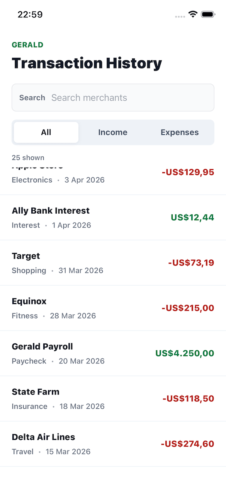
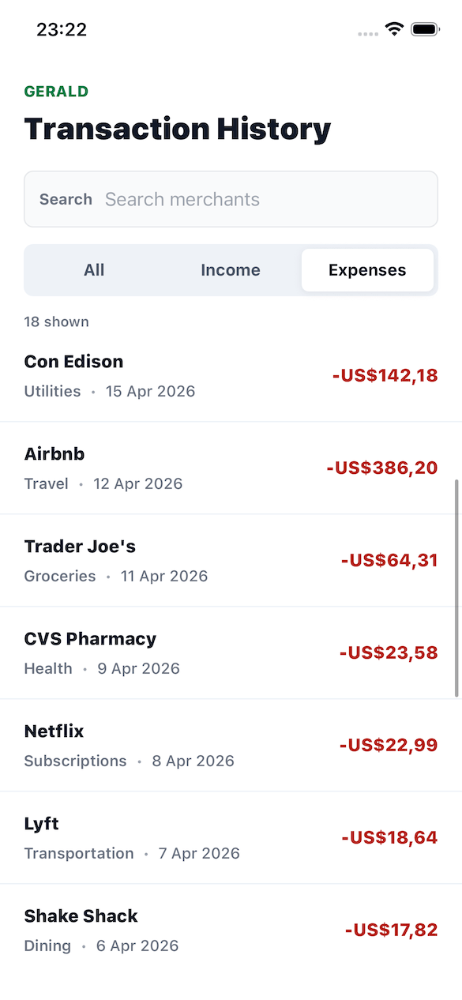

# Gerald Transaction History Demo

Mobile implementation for the **Gerald Impact Engineer - React Native Frontend** assessment using React Native CLI, React 19.1.1, React Native 0.82.1, and TypeScript.

Download APK file at: https://drive.google.com/file/d/1jFLxq4RUo47UYFZtUXMXbr0Vo7hiHqA3/view?usp=sharing

## Tech stack

### App platform

- `react-native` `0.82.1` — React Native CLI project with committed `ios/` and `android/` native folders
- `react` `19.1.1`
- `react-native-safe-area-context` `^5.7.0`

### Language & tooling

- `typescript` `^5.8.3`
- `@react-native/typescript-config` `0.82.1`
- `eslint` `^8.19.0`
- `prettier` `2.8.8`

### Testing

- `jest` `^29.6.3`
- `react-test-renderer` `19.1.1`

### Native setup

- CocoaPods + Bundler for iOS dependency installation
- Gradle wrapper for Android builds

## Screenshots

### Transaction list



### Filtered expenses


### Empty search state



## Implemented features

### 1. Transaction List Screen

- Fetches transactions from a mock asynchronous data source in `src/services/transactionsApi.ts`.
- Uses 25 realistic mock transactions from `src/data/transactions.ts`, covering payroll, groceries, dining, subscriptions, utilities, travel, shopping, and reimbursements.
- Displays the required fields for each transaction: merchant name, amount, date, and category.
- Formats currency as USD with `Intl.NumberFormat`.
- Formats dates with `Intl.DateTimeFormat` in a locale-aware way.
- Color-codes income in green and expenses in red.
- Renders the list with `FlatList` for standard React Native virtualization.

### 2. Filter Functionality

- Supports the required transaction type filters: `All`, `Income`, and `Expenses`.
- Supports merchant-name search through a dedicated search input.
- Search is debounced by 300 ms via `useDebouncedValue`, so filtering does not run on every keystroke.
- Filter and search are composed together, so users can search within income-only or expense-only views.
- The visible transaction count updates as filters change.

### 3. States & Edge Cases

- Initial loading state uses skeleton transaction rows.
- Full-screen error state includes a retry action when the first fetch fails.
- Inline refresh error state includes a retry action when a later refresh fails after data has already loaded.
- Empty state is shown when no transaction matches the current search/filter combination.
- Pull-to-refresh is implemented with React Native `RefreshControl`.
- Accessibility labels and roles are provided for the search input, filter tabs, retry actions, refresh control, transaction list, and transaction rows.

### 4. README / Submission Coverage

- This README documents the technical stack, implemented assignment requirements, setup instructions, screenshots, tests, project structure, trade-offs, and future improvements.
- Screenshots are included from root-level `screenshot_1.png`, `screenshot_2.png`, and `screenshot_3.png`.

## Architecture notes

### Data boundary

The mock transaction records live in `src/data/transactions.ts`, while `src/services/transactionsApi.ts` exposes the asynchronous fetch boundary. Components do not import raw mock data directly, so replacing the mock with a real API would be localized to the service layer.

### Domain model

The shared `Transaction` type lives in `src/types/transaction.ts`. Mock data, utilities, API code, and UI components all depend on the same contract.

### Filtering and formatting

Filtering logic lives in `src/utils/transactions.ts` as pure functions, which keeps business rules easy to test without rendering React Native components.

Currency and date formatting live in `src/utils/formatters.ts`. The formatters are created once at module scope instead of being recreated for every rendered row.

### State management

Local React state is enough for this assessment because the feature is a single screen with one data source. Adding Redux, Zustand, React Query, or navigation would increase project surface area without solving a current requirement.

## Performance considerations

- `TransactionRow` is wrapped in `React.memo`.
- `FlatList` uses a stable `keyExtractor`.
- `getItemLayout` is provided because rows have a fixed height.
- `renderItem` and `keyExtractor` are defined outside the screen component.
- UI event handlers are wrapped with `useCallback`.
- Filtered transactions and display-ready rows are derived with `useMemo`.
- `initialNumToRender`, `maxToRenderPerBatch`, `windowSize`, and `removeClippedSubviews` are configured for predictable list behavior.

For hundreds or low thousands of local records, this approach remains reasonable because filtering is simple string/type matching and rendering is virtualized. For larger production datasets, I would move filtering/search to the API or an indexed local store, add pagination, and avoid fetching the entire transaction history at once.

## Run locally

### 1. Install JavaScript dependencies

```bash
npm install
```

### 2. Install iOS pods

```bash
bundle install
cd ios
bundle exec pod install
cd ..
```

### 3. Start Metro

```bash
npm run start
```

### 4. Launch the app

```bash
npm run ios
# or
npm run android
```

## Validation

### Type check

```bash
npm run typecheck
```

### Lint

```bash
npm run lint
```

### Tests

```bash
npm test
```

## Test coverage

Tests live in `src/__tests__`.

### `formatters.test.ts`

- Validates USD currency formatting for positive and negative amounts.
- Validates date formatting with an explicit timezone to avoid environment-dependent failures.

### `transactions.test.ts`

- Validates the `All`, `Income`, and `Expenses` filters.
- Validates case-insensitive merchant search.
- Validates trimmed search input.
- Validates combined type filtering and merchant search.

### `transactionsApi.test.ts`

- Validates that the mock source includes at least 20 transactions.
- Validates income and expense amount signs.
- Validates newest-first ordering.
- Validates that the mock API does not mutate source data.
- Validates failed request and retry behavior.

## Trade-offs

- No navigation: the challenge is scoped to one screen.
- No global store: local state is simpler and sufficient.
- No UI kit: styles are implemented with `StyleSheet.create` to keep the dependency footprint small.
- No data-fetching library: the async mock API is straightforward enough to manage directly.
- No FlashList: `FlatList` is sufficient for the current data size and avoids an extra dependency.
- No persisted cache/offline mode: this would be valuable in production but was outside the take-home scope.
- No full React Native Testing Library suite: utility and API tests provide the highest signal with minimal setup for this prototype.

## What I would improve with more time

- Add cursor-based pagination or infinite scrolling once the real API contract is known.
- Add a typed API client with runtime response validation.
- Add component tests for loading, filtering, search, empty state, retry, and pull-to-refresh behavior.
- Add analytics for filter changes, search usage, refresh, retry, and empty results.
- Add offline cache support for recent transactions.
- Validate accessibility with VoiceOver and TalkBack on real devices.
- Integrate Gerald's production design system for typography, spacing, color, and reusable controls.

## Project structure

- `App.tsx`: application entry that renders `TransactionHistoryScreen`
- `src/screens/TransactionHistoryScreen.tsx`: screen orchestration, loading/error/refresh state, filtering, search, and list rendering
- `src/components/`: presentational UI components for rows, filters, search, skeletons, empty state, and error state
- `src/data/transactions.ts`: mock transaction records
- `src/services/transactionsApi.ts`: asynchronous mock API boundary
- `src/types/transaction.ts`: shared transaction domain types
- `src/utils/formatters.ts`: currency and date formatting
- `src/utils/transactions.ts`: pure filtering/search logic
- `src/utils/debounce.ts`: debounced value hook
- `src/__tests__/`: Jest tests for formatting, filtering, and mock API behavior
- `ios/`: native iOS project
- `android/`: native Android project
